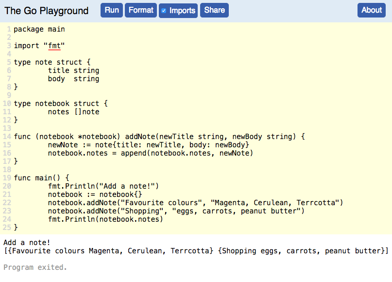

# Notemaker
## A command line notes program in Go

An exercise for getting to grips with using strucs in Go.

### Running the programme



### Extensions & I/O

In order to run the programme from the command line (without a repl like go playground), we would add the ability to interact via strings from command line input. Along the lines of:

```
package main

import (
    "bufio"
    "fmt"
    "os"
)

func main() {
    buf := bufio.NewReader(os.Stdin)
    fmt.Print("> ")
    sentence, err := buf.ReadBytes('\n')
    if err != nil {
        fmt.Println(err)
    } else {
        fmt.Println(string(sentence))
    }
}
```
